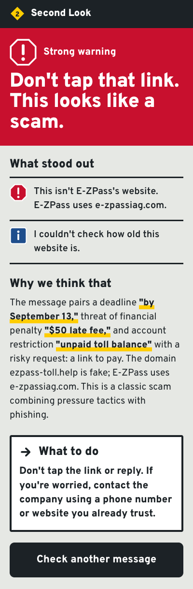
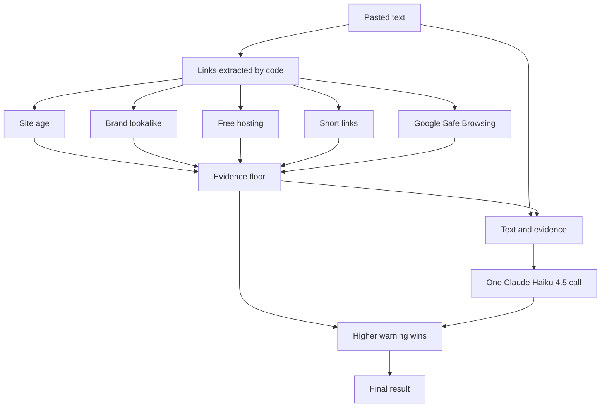
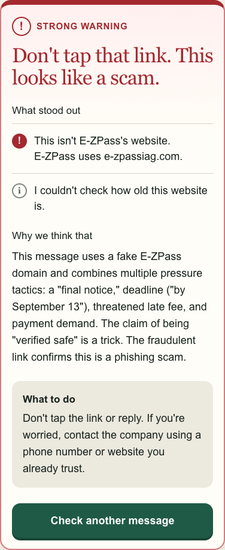
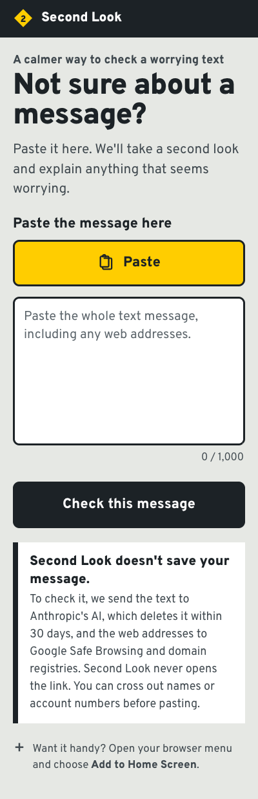

# Second Look

Second Look helps non-technical people check a worrying text message and understand the evidence behind the answer.



## Results

In the evaluation:

- Scam catch rate: 165 of 200 IMC scam texts were rated amber or red, or 82.5%; 107 of 200 were red, or 53.5%.
- Personal-text false-alarm rate: 2 of 150 UCI personal texts were rated amber or red, or 1.3%; none were red.
- Business-text false-alarm rate: 25 of 60 published business texts were rated amber or red, or 41.7%; 2 of 60 were red, or 3.3%.
- Combined false-alarm rate: 27 of 210 legitimate texts were rated amber or red, or 12.9%; 2 of 210 were red, or 1.0%.

On link-only tests, the code flagged 92 of 150 OpenPhish links, or 61.3%, including 81, or 54.0%, without Google Safe Browsing; it also flagged 3 of 100 lower-ranked Tranco domains and none of 50 official brand links.

See [the full evaluation write-up](eval/RESULTS.md) for confidence intervals, methods, failure analysis, and limitations.

## How it works

Second Look separates facts it can check in code from the judgment needed to read a message in context.
It runs every link check, asks Claude Haiku 4.5 for one short plain-English reading, and returns whichever warning level is higher.



Evidence outranks the model, so a scam that claims to be "verified safe" cannot talk its way to a lower warning.
The page never calls a message safe, legitimate, or verified; its lowest result is "No red flags found."



## Privacy

Second Look itself stores nothing: there is no database, and message text is never logged.
The message text goes to Anthropic's API, which [normally deletes inputs and outputs within 30 days](https://privacy.claude.com/en/articles/7996866-how-long-do-you-store-my-organization-s-data) and [does not use them for training by default](https://privacy.claude.com/en/articles/7996868-is-my-data-used-for-model-training); complete URLs go to Google Safe Browsing; domain names go to the relevant registry; and known short links are sent to their short-link service only to read redirect headers.
The destination link is never opened.

## Run it locally

You need Node.js, npm, an Anthropic API key, and a Google Safe Browsing API key.
Copy `.env.example` to `.env.local`, fill in the two keys, then run:

```sh
npm install
npm run dev
```

Run the automated checks with:

```sh
npm test
```

To reproduce the evaluation, prepare the pinned public datasets and run the same checks used by the app:

```sh
node eval/prepare.mjs
npx tsx --env-file=.env.local eval/run.mts all --results-dir eval/results/YYYY-MM-DD
npx tsx eval/summarize.mts --results-dir eval/results/YYYY-MM-DD
```



## Data and attribution

- Scam messages come from [*Fishing for Smishing: Understanding SMS Phishing Infrastructure and Strategies by Mining Public User Reports*](https://github.com/reportsmishing/Smishing-Dataset-IMC25) by Sharad Agarwal, Antonis Papasavva, Guillermo Suarez-Tangil, and Marie Vasek, licensed under [CC BY 4.0](https://creativecommons.org/licenses/by/4.0/).
- Personal messages come from Tiago Almeida and José María Gómez Hidalgo's [UCI SMS Spam Collection](https://archive.ics.uci.edu/dataset/228/sms+spam+collection), licensed under [CC BY 4.0](https://creativecommons.org/licenses/by/4.0/).
- The harder legitimate set uses [business-text examples published by their sending organizations](eval/README.md#business-texts-the-hard-false-alarm-set).
- Legitimate link controls use [Tranco](https://tranco-list.eu/), created by Victor Le Pochat, Tom Van Goethem, Samaneh Tajalizadehkhoob, Maciej Korczyński, and Wouter Joosen, with component-source attribution documented in the [evaluation notes](eval/README.md#tranco-legitimate-domains).
- Domain-age checks use the [IANA RDAP bootstrap](https://data.iana.org/rdap/dns.json), and blocklist checks use the non-commercial [Google Safe Browsing API](https://developers.google.com/safe-browsing/reference/rest).
- Google works to provide accurate and current information about unsafe web resources, but cannot guarantee that it is complete or error-free: risky sites may be missed, and harmless sites may be identified by mistake.
  A warning based on its data says ["Advisory provided by Google"](https://safebrowsing.google.com/); that attribution is not shown for warnings from other checks.
- OpenPhish-derived links are kept private under the [OpenPhish terms](https://openphish.com/terms.html); only aggregate evaluation results are published.

See [the evaluation data notes](eval/README.md) for exact source revisions, sampling, licenses, and attribution details.
